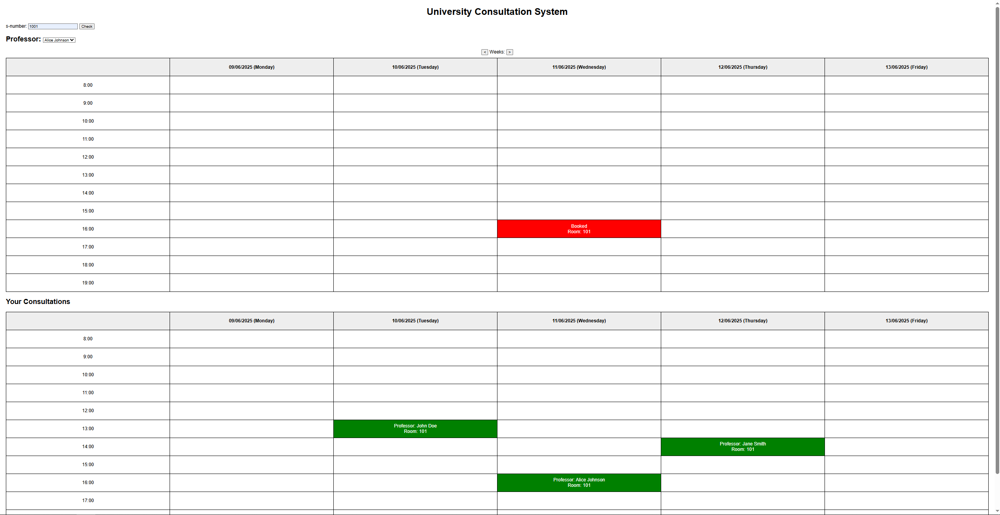

# Student Consultation Scheduler

A Java Spring Boot-based web application to manage and schedule student consultations with university professors. It includes a backend API and a dynamic frontend calendar interface.

## Features

- Full scheduling system for student-professor consultations.
- Validation of professor availability and room availability.
- Weekly calendar view with interactive booking, rescheduling, and canceling.
- Minimalistic, user-friendly frontend interface.

## Frontend Web Application

The web interface allows easy scheduling and management of consultations. Here's how it works:

- Enter your student number (`s-number`) and click **Check**.
- Choose a professor from the dropdown list.
- A weekly calendar will appear:
  - **Red cells** indicate already booked slots.
  - **White cells** indicate available time slots.
  - Left-click on an available slot to **book** a consultation.
  - Your consultations will appear in the bottom calendar:
    - **Right-click** to **reschedule**.
    - **Left-click** to **delete** the consultation.

### Screenshot



## Technologies Used

- **Backend**: Java 17+, Spring Boot
- **Frontend**: HTML, CSS, JavaScript
- **Database**: H2

## Running the Application

1. Clone the repository:
   ```bash
   git clone https://github.com/your-username/student-consultation-scheduler.git
   cd student-consultation-scheduler
   ```

2. Start the backend server:
   - **Windows**:
     ```bash
     run.bat
     ```

3. Access the web application at:
   ```
   http://localhost:8080
   ```
